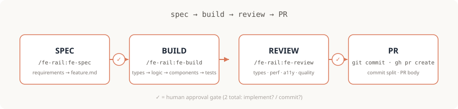

# fe-rail

<div align="right">
  <a href="README.ko.md"></a>
  <a href="README.md"></a>
  <a href="LICENSE"></a>
  <a href="https://www.claudepluginhub.com/plugins/sh5623-fe-rail?ref=badge"></a>
</div>

> Frontend-focused Claude Code plugin
> Automated spec → build → review → PR workflow for Next.js App Router / Vite SPA (TanStack Router · React Router 7·8) + TypeScript, with full Tailwind v3/v4 / shadcn/ui support.

## Installation

```bash
claude

/plugin marketplace add sh5623/fe-rail
/plugin install fe-rail@fe-rail-market
```



## Usage

```
$ claude
> /fe-rail:fe-spec

[fe-spec] Analyzing requirements... (fe-analyst, fe-architect)
✔ feature.md generated — 7 sections, 3 open questions resolved

Next step?
  ❯ Full auto (recommended) — hand off to fe-start automatically
    Build only — I'll review the spec first
    Revise spec

> Full auto

[fe-start] Phase 2 — implementing types → hooks → components → tests
✔ 12 files created, tsc clean, lint clean, 8 tests passing

Commit and open a PR?
  ❯ Yes — split by type (feat/fix/test) and open a draft PR
    No — leave changes uncommitted

> Yes

✔ 2 commits created
✔ Pushed to feat/product-search-autocomplete
✔ Draft PR: https://github.com/you/your-app/pull/42
```

Two human touch-points total — **"Implement?"** and **"Commit?"** — everything else runs unattended.

## Skills

| Skill | Command | Description |
|-------|---------|-------------|
| fe-spec | `/fe-rail:fe-spec` | Requirements → structured spec document. Phase 3 presents a radio UI to choose the next step (full auto · build only · revise spec) — selecting "full auto" hands off directly to the fe-start pipeline |
| fe-build | `/fe-rail:fe-build` | Frontend implementation (types → logic → components → tests) |
| fe-review | `/fe-rail:fe-review` | 4-axis code review: types · performance · a11y · quality |
| fe-start | `/fe-rail:fe-start feature.md` | All-in-one — automates through PR creation. Phase 1 · 5 use radio UI to confirm implementation and commit intent |
| fe-doc-sync | `/fe-rail:fe-doc-sync` | Scans the **consumer project** (routes · deps · structure · ENV) → proposes updates to that project's CLAUDE.md · README.md |

## Hooks

Policy: **Block dangers (exit 2), warn on quality issues (stderr)**.

| Hook | Event | Role | Blocks |
|------|-------|------|--------|
| `session-init.sh` | SessionStart | Remote version check + new version notification (GitHub, once/day) | — |
| `guard.sh` | PreToolUse:Bash | Blocks `git add .`, force push, `--no-verify`, `rm -rf /`, `DROP TABLE`, `git reset --hard`, `git checkout/restore .`, etc. | ✅ |
| `write-guard.sh` | PreToolUse:Write\|Edit\|MultiEdit | Blocks creating/editing sensitive files: `.env*`, certificates (`*.pem`/`*.key`, etc.), secret-payload files (`*.secret`, `*credentials*.json`, etc.) — source files like `.env.example`, `CredentialForm.tsx` are allowed | ✅ |
| `config-protection.sh` | PreToolUse:Write\|Edit\|MultiEdit | Blocks only **weakening** edits to linter/formatter/TS config — `strict:false`, `@ts-nocheck`, linter `recommended:false`, removing an existing `strict:true`. Normal edits (path aliases, adding plugins, etc.) pass through | ✅ |
| `read-guard.sh` | PreToolUse:Read | Warns on sensitive file reads (`.env*`·`.envrc`, keys like `*.pem`/`*.key`/`id_rsa`, `.npmrc`·`*credential*` — symmetric with write-guard's block list) | — |
| `task-guard.sh` | PreToolUse:Task\|Agent | Blocks injection patterns and dangerous command delegation in sub-agent prompts | ✅ |
| `lint-fix.sh` | PostToolUse:Edit\|Write\|MultiEdit | Auto-detects consumer env → runs Biome `check --write` **or** ESLint `--fix` (+ Prettier) (local binary first · npx fallback is opt-in via `FE_RAIL_ALLOW_NPX=1`) | — |
| `nextjs-guard.sh` | PostToolUse:Edit\|Write\|MultiEdit | Detects React hooks/browser API/DOM events in Server Components; warns when `page`/`layout` in the app router is missing `'use client'` | — |
| `design-nudge.sh` | PostToolUse:Edit\|Write\|MultiEdit | Warns on generic/templated (AI-slop) signals in frontend edits (heavy/arbitrary shadows, default purple/indigo gradients). **Silent if DESIGN.md exists** (fe-reviewer's DESIGN Bans is the source of truth in that case) | — |
| `quality-gate.sh` | Stop | Runs linter (Biome **or** ESLint) + type check (prefers the project's `typecheck` script, falls back to `tsc -b` for solution-style tsconfig) on changed files, outputs warnings. Type check is judged by exit code (no false positives from success banners) · also triggers on `tsconfig*.json`/`package.json` changes even with no source changes | — |
| `doc-sync-check.sh` | Stop | Detects changes to consumer project code / package.json / config files → suggests `/fe-rail:fe-doc-sync` (includes last 5 commits) | — |
| `notify.sh` | (Optional) Notification | macOS terminal-notifier banner — activate with `bash hooks/scripts/setup-notifier.sh` | — |

### Hook profiles & toggles (intensity control)

Hook intensity can be tuned via **environment variables** (no plugin file edits needed — set in the consumer project's shell/`.claude` environment).

| Env var | Value | Effect |
|---|---|---|
| `FE_RAIL_HOOK_PROFILE` | `minimal` | Only the irreversible-risk **blockers** (`guard`, `write-guard`, `task-guard`, `config-protection`). Quality warnings, auto-cleanup, and doc-sync prompts are turned off |
| | `standard` (default) | The above + all quality warnings/auto-cleanup/doc-sync |
| | `strict` | One tier above `standard` (currently a superset, reserved for stricter behavior in the future) |
| `FE_RAIL_DISABLED_HOOKS` | `"a,b"` | Disable specific hooks by name (e.g. `"doc-sync-check,design-nudge"`) |
| `FE_RAIL_ALLOW_NPX` | `1` | Allow npx fallback when no local linter or `tsc` binary is present (default is local-only — prevents auto-hooks from downloading or running unpinned latest versions). Doesn't affect a project's own `typecheck` script, which always runs via the package manager |
| `FE_RAIL_ALLOW_PW_INSTALL` | `1` | Lets fe-start's Phase 4.5 gate install Playwright browsers automatically (`playwright install --with-deps chromium`). Off by default — it's a several-hundred-MB download and `--with-deps` needs root, so an unattended pipeline shouldn't trigger it silently. While off, E2E is honestly reported as "not run (browsers missing)" rather than passed |

> **Downgrading the profile to `minimal` does not disable the safety blockers** — to turn them off, name them explicitly in `FE_RAIL_DISABLED_HOOKS` ("no-compromise blocking" + an explicit escape hatch). A non-default profile or a disabled-hooks list is announced at session start.

### Regression eval

```bash
bash eval/run.sh   # exits 1 on failure (CI-ready)
```

Deterministically verifies, with no live model required: hook behavior (fixture injection → exit code/warning assertions, including that block reasons go to stderr rather than stdout, and that the 5 non-blocking hooks' notices also go to stderr), profile toggles, and plugin self-lint (agent `model` value within the valid set — alias `opus`/`sonnet`/`haiku`/`fable`/`inherit` or a full model ID; agent `effort` value within `low`/`medium`/`high`/`xhigh`/`max` where set, and never set on `haiku` agents (unsupported); skill frontmatter; frontmatter plain scalars staying YAML-safe — a value containing `: ` (colon+space) breaks parsing and silently drops the whole frontmatter, including `tools`, `disallowedTools`, and `model`; `hooks.json` integrity, profile wiring, delegating skills listing Task/Agent in allowed-tools, bun `PX` detection consistency, typecheck branches always pairing a `references`(tsc -b) fallback, and binary+flag invocations using `$PX` rather than `$PM exec`). Useful for catching regressions when alias tiers shift with model updates, or when hooks/config change.

## Agents

Each agent runs in an isolated context, protecting the main session from noise.
Structure: frontmatter (`tools`/`disallowedTools`/`model`/`maxTurns`) + XML tags (`<purpose>`/`<forbidden>`/`<required>`/`<workflow>`/`<output>`).

> **Model tiers are aliases.** Each agent's `model` is set to `opus`/`sonnet`/`haiku` — automatically using the latest tier on model family updates (e.g. Opus 4.8 → Opus 5) **on the Anthropic API**, where the aliases resolve to Opus 5 · Sonnet 5 · Haiku 4.5 (verified 2026-07). On Claude Platform on AWS, Amazon Bedrock, Google Cloud, or Microsoft Foundry, the same alias resolves to an older generation — as of the same date: Claude Platform on AWS `sonnet`=Sonnet 4.6, Amazon Bedrock / Google Cloud `sonnet`=Sonnet 4.5, Microsoft Foundry `opus`=Opus 4.6 and `sonnet`=Sonnet 4.5. Check Claude Code's model-config docs for your provider's exact resolution. Behavior may vary even with the same plugin version; run regression checks on each release if reproducibility matters.
> Tier allocation: **opus** (high-judgment — `fe-analyst` · `fe-architect` · `fe-reviewer` · `fe-refactor-advisor`) / **haiku** (low-cost exploration — `fe-explorer`) / **sonnet** (all other execution/tool agents).
> **Effort is pinned per agent, not inherited from the session** — otherwise a consumer running `/effort max` would push every fe-rail subagent to max. `high` for judgment gates and precision audits, `xhigh` for code-writing loops (`fe-build-fixer`, `fe-test-author`), `medium` for mechanical tool/research agents; `fe-explorer` (haiku) has none set, since Haiku doesn't support effort. Note that `xhigh` requires Sonnet 5 / Opus 4.7+ — on third-party providers where `sonnet` still resolves to 4.5/4.6, drop `fe-build-fixer` · `fe-test-author` to `high` if you hit an effort-related error.

### Spec stage
| Agent | When to delegate | Model | Isolation |
|-------|-----------------|-------|-----------|
| `fe-analyst` | Requirements gap analysis (6 gaps / 7 sections); parallel scan of CLAUDE.md · DESIGN.md · PRODUCT.md · AGENTS.md | opus | Scoped (read-only) |
| `fe-deck-reader` | PPT/deck decomposition — breaks multi-slide specs into policies · screens · flows (via PDF/PNG conversion) | sonnet | Scoped (read-only) |
| `fe-vision` | (Extract) Figma · UI screenshots · PDF · PPT (via conversion) per-screen analysis (Figma URL → `get_metadata` · `get_design_context` · `get_variable_defs` · `get_screenshot`; DESIGN.md Bans anti-slop check) · (Contrast) implementation screenshot ↔ reference visual fidelity judgment (visual-verdict — Figma=pixel/PPT=layout, fe-start Phase 4.5) | sonnet | Scoped (read-only) |
| `fe-researcher` | External docs · library research (Context7 MCP preferred, WebSearch/WebFetch fallback) | sonnet | Tool (Context7/WebSearch/WebFetch) |
| `fe-architect` | React/TS architecture — Next.js (RSC boundaries) / Vite SPA (TanStack Router · React Router 7·8 · Zustand) + Tailwind v3/v4 · shadcn · openapi-fetch (orthogonal detection) | opus | Scoped (read-only) |

### Build stage
| Agent | When to delegate | Model | Isolation |
|-------|-----------------|-------|-----------|
| `fe-explorer` | Codebase exploration (3+ queries) | haiku | Context |
| `fe-test-author` | BDD scenario derivation + TDD Red-Green-Refactor | sonnet | Scoped (implementation) |
| `fe-build-fixer` | tsc · linter (ESLint/Biome) error fixes with minimal diff | sonnet | Tool (Edit+Grep, Write/MultiEdit blocked) |

### Review stage
| Agent | When to delegate | Model | Isolation |
|-------|-----------------|-------|-----------|
| `fe-reviewer` | 4-axis review (type · performance · a11y · quality — performance axis now covers React hook runtime bugs: missing cleanup · async race · infinite loop; includes Tailwind anti-patterns · openapi-fetch patterns · DESIGN.md design contract, if present) | opus | Scoped (read-only) |
| `fe-a11y-auditor` | 8-axis a11y audit (Color Contrast — Tailwind palette-based included). `--live` runs a real Lighthouse a11y audit + accessibility-tree snapshot via Chrome DevTools MCP when installed; static-only otherwise | sonnet | Scoped (read-only) |
| `fe-perf-auditor` | Performance audit — Next.js (RSC · next/image · next/font) / Vite SPA (TanStack loader · RR7·8 TQ prefetch · fetchpriority · bundle) / Tailwind v3/v4 (purge · @source · @apply). `--live` runs a real dev-server measurement (LCP breakdown, console, network) via Chrome DevTools MCP when installed; static-only otherwise | sonnet | Scoped (read-only) |
| `fe-test-runner` | Test execution + failure classification | sonnet | Context |
| `fe-refactor-advisor` | 6-dimension refactoring analysis + Before/After | opus | Scoped (read-only) |

### PR stage
| Agent | When to delegate | Model | Isolation |
|-------|-----------------|-------|-----------|
| `fe-git-operator` | Commit splitting · safe staging + body authoring (fix = symptom·cause·fix / feat = added·core·impact) | sonnet | Tool (Write/Edit blocked) |
| `fe-pr-author` | PR body authoring (🐛/✨ blocks by change type + risk-ordered review points) + `gh pr create` | sonnet | Context + Tool |

## Workflow

**All-in-one automation (fe-start)**
```
Write feature.md → /fe-rail:fe-start feature.md → [radio] "Implement?" → [radio] "Commit?" → PR created
```

> If the same item still isn't resolved after 3 re-delegation attempts, an extra STOP can trigger — automation pauses and reports a diagnosis instead of looping indefinitely.

**fe-spec → full-auto handoff**
```
/fe-rail:fe-spec → [radio] select "Full auto" → fe-start runs automatically → [radio] "Commit?" → PR created
```
> Selecting "Full auto" at fe-spec's "next step" gate counts as the first approval ("Implement?"), so fe-start only asks "Commit?" — two human approvals are still preserved overall.

**Step-by-step manual control**
```
/fe-rail:fe-spec → /fe-rail:fe-build → /fe-rail:fe-review → git commit && gh pr create
```

## Prerequisites

- Claude Code
- Package manager (pnpm / npm / yarn / bun — auto-detected via lockfile)
- gh CLI (for automated PR creation)
- TypeScript strict mode (Next.js / Vite SPA)

## Post-install Recommended Setup (Consumer Project)

Plugin agents read and reason from the **consumer project's context**. Setting these up right after installation significantly improves output quality.

| Item | Why | How |
|------|-----|-----|
| **Project CLAUDE.md** | `fe-analyst` · `fe-architect`, etc. read the stack · rules · constraints from it — without it, agents analyze blind (this plugin's own CLAUDE.md is not loaded into consumer sessions) | `/init` or `/fe-rail:fe-doc-sync` |
| **Bash permissions** | Prevents a permission prompt on every `fe-git-operator` · `fe-pr-author` action | Auto: run `bash <install-path>/hooks/scripts/setup-permissions.sh` from the project root (detects host → merges into `.claude/settings.local.json`, confirm once) · Manual: add `Bash(git *)` · `Bash(gh pr *)` to `permissions.allow` in `.claude/settings.json` |
| **MCP (optional)** | Enables `fe-vision`'s direct Figma lookups, `fe-researcher`'s Context7 doc queries, and `fe-perf-auditor`/`fe-a11y-auditor`'s live measurement via `--live` (falls back to local images / WebSearch / static analysis if not installed) | Figma: claude.ai connector (`/mcp` → "claude.ai Figma", OAuth) · Context7: install the plugin · Chrome DevTools: install the plugin. If not installed, each agent falls back and surfaces the enable command just-in-time (JIT) |
| **Validation scripts** | Phase 3 auto-validation uses `typecheck`/`lint`/`test`; the Phase 4.5 done-criteria gate uses `build`/`e2e` if present | Define those scripts |

## License

[MIT](LICENSE) © 2026 이승호

## References

- [addyosmani/agent-skills](https://github.com/addyosmani/agent-skills)
- [Chachamaru127/claude-code-harness](https://github.com/Chachamaru127/claude-code-harness)
- [garrytan/gstack](https://github.com/garrytan/gstack)
